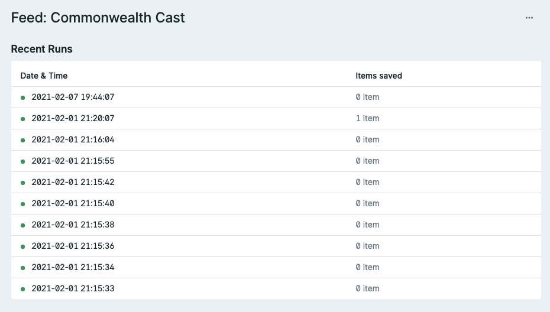

# YumYum

YumYum is a Statamic addon which lets you import data from common formats like RSS & JSON and save them as Entries or Taxonomy Terms.

**Features**

* Import data from RSS, JSON, XML (coming soon) & CSV (also coming soon)
* Saveable as Entries or Taxonomy Terms.
* Ability to regularly run feed imports or run them on-demand through the Control Panel.
* A history log of recent runs.
* Can use Laravel's queuing system so you can run imports in the background.

**Licensing**

YumYum is a commercial addon available for purchase from the Statamic Marketplace. Licenses cost $29 per site. [Buy now!](https://statamic.com/yumyum)

**Support**

For bug reports or feature requests, [open a Github issue](https://github.com/doublethreedigital/yumyum/issues/new)! For anything else, [drop me an email](mailto:hello@doublethree.digital).

## Documentation

### Installation

**Via the Control Panel:**

1. In the Control Panel, go to `Addon` on the left menu.
2. On the addons page, search for `YumYum` and click on the first result that comes up.
3. Click `Install`
4. After installation is complete, you should be able to view a `Feeds` page in the CP, from there you can get started!

**Via composer:**

1. Require YumYum `composer require doublethreedigital/yumyum`
2. Once complete, you should be able to view a `Feeds` page in the CP, from there you can get started!

### How it works

YumYum has a concept of feeds, each feed has it's own source (a JSON, RSS, XML feed) and has a destination, whether that be entries in a collection or terms in a taxonomy.

Whenever a feed is run, it goes through three steps:

1. It'll use a 'source parser' to get the items from the feed and return it in such a way everything else can understand.
2. Then, the feed items will pass through a 'transformer', this decides how to map the data from your feed item into your fields.
3. After the data has been transformed, it will finally be saved as an entry or taxonomy term.

### Viewing Run History

If you want check the last time YumYum ran your feed, you can have a look at its 'run history'.

To view the history log, click on the name of your feed in the `Feeds` page of the Control Panel. You should then be able to view the last 10 times the feed has been run. It'll tell you both the date/time of last run and how many items were saved as part of that run. This may be helpful if you need to troubleshoot your feed not working correctly.



### Running your feed

This is probably what you installed YumYum for, to actually import & save your data! You've got two options when it comes to running your feed. You can either run it whenever you want via the CP or you can run it automatically with CRON/Laravel's scheduler.

**On-demand via the CP:**

1. In your `Feeds` page in the Control Panel, find the feed you'd like to run.
2. Click on the button at the end of the feed row, and click on the 'Run' option.
3. Your feed will now be running, either on your request, or on the queue, depending on your site's configuration.

**Automatically with the Laravel Scheduler:**

We're only going to cover the process of actually adding YumYum's command to the Laravel scheduler, not how to setup the scheduler on your server. You can learn about that over on the [Laravel documentation](https://laravel.com/docs/master/scheduling#running-the-scheduler).

1. Open your `app/Console/Kernel.php` file.
2. Add the below snippet to the `schedule` method of the `Kernel.php` file

```php
/**
 * Define the application's command schedule.
 *
 * @param  \Illuminate\Console\Scheduling\Schedule  $schedule
 * @return void
 */
protected function schedule(Schedule $schedule)
{
    // $schedule->command('inspire')
    //          ->hourly();

    $schedule->command('yumyum:run')
        ->hourly();
}
```

That snippet will run YumYum's importer every hour. You may wish to adjust the schedule on which it's run, for that you may view the [Laravel documentation](https://laravel.com/docs/master/scheduling#schedule-frequency-options).

### Destination Transformers

Destination Transformers (also sometimes referred to as simply, Transformers) are classes used in between the step of getting your data and saving your data. If you're familiar with Laravel, a transformer is kind of like an [API resource](https://laravel.com/docs/master/eloquent-resources#concept-overview).

By default, YumYum uses a really simple transformer, where everything from the feed's response is then saved.

```php
<?php

namespace DoubleThreeDigital\YumYum\Feeds\Transformers;

use DoubleThreeDigital\YumYum\Contracts\Transformer as Contract;

class Entry implements Contract
{
    protected array $item;

    public function __construct(array $item)
    {
        $this->item = $item;
    }

    public function toArray(): array
    {
        return $this->item;
    }
}
```

The `$item` is passed in to your constructor and then your `toArray` method should return an array of data (this is what get's saved).

However, most of the time you'll probably want to use your own, custom transformer. To make it easy, run `php please yumyum:transformer`, followed by the name of your transformer, for example:

```
php please yumyum:transformer WordPress
```

The comamnd will generate a `WordPress` transformer in your `App\Transformers` directory with some boilerplate code, enough for you to get started!

**Mapping to fields**

As you know, the `toArray` method should return an array of data, this is what is later saved as an Entry or Term, depending on what you have configured. Most of the time, you'll want to map the data you get back from the feed to your own fields, setup in your blueprint.

Let's take a [Transistor.fm feed](https://feeds.transistor.fm/commonwealth-cast) for example and let's map it to our custom fields.

```php
public function toArray(): array
{
    return [
        'title' => $this->item['title'],
        'embed_url' => str_replace('https://share.transistor.fm/s/', 'https://share.transistor.fm/e/', $this->item['link']),
        'show_notes' => $this->item['description'],
    ];
}
```

> **🔥 Hot Tip:** You can use [`array_merge`](https://www.php.net/manual/en/function.array-merge.php) to pull in existing attributes as well as your custom ones.
